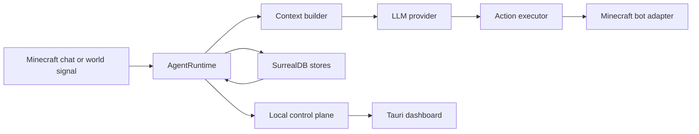

# Minecraft AI Companion

Local-first Minecraft companion runtime built around Mineflayer, SurrealDB, and an OpenAI-compatible model provider. The bot joins as a normal player, observes chat and world state, replies in-world, remembers important events, and reconnects or retries without requiring a central coordinator.

## What This Repo Is

The project has two faces:

- `npm start` runs the headless agent runtime.
- `dashboard/` contains the optional Tauri operator console that can launch and monitor the runtime locally.

Major pieces:

- `scripts/startAgent.js` bootstraps config, storage, the bot adapter, the runtime, and the local control plane.
- `agent/` owns turn execution, retries, reconnects, background workers, and runtime state.
- `minecraft/` wraps Mineflayer and translates bot actions into protocol calls.
- `ai/` wraps the model providers and prompt construction.
- `memory/` persists messages, events, jobs, worlds, sessions, identity, and learning state in SurrealDB.
- `builder/` turns natural build requests into structure plans and placement jobs.
- `reflex/` classifies world events and emits automatic reflex jobs.
- `control/` exposes the local HTTP/WebSocket control plane used by the dashboard.
- `shared/contracts/` is the runtime/dashboard contract surface.
- `structures/` holds structure templates and retry signature constants.
- `schemas/` defines the SurrealDB schema and event triggers.

## High-Level Flow



## Quick Start

1. Install dependencies.

```bash
npm install
```

2. Start a local SurrealDB instance.

```bash
npm run db:start
```

This stores local data under `.local/guardian-memory` and binds SurrealDB on `127.0.0.1:8000`.

3. Copy `.env.example` to `.env` and set the Minecraft host plus one model provider.

4. Start the runtime.

```bash
npm start
```

5. Optional: start the operator dashboard.

```bash
cd dashboard
npm run tauri:dev
```

The dashboard uses the local control plane and can spawn the runtime for you.

## Environment Overview

### Minecraft

- `MC_HOST`, `MC_PORT`: Minecraft server or LAN host.
- `MC_VERSION`: optional Mineflayer protocol version override.
- `MC_AUTH`: `offline` for local/LAN, `microsoft` for authenticated servers.
- `PRIMARY_PLAYER` / `MC_PRIMARY_PLAYER`: trusted primary operator, default `Sage`.
- `MC_BOT_USERNAME`: in-world bot username, default `Guardian`.
- `COMPANION_ROLE`: prompt-facing role description for the companion.
- `COMPANION_PERSONALITY`: prompt-facing personality description.
- `MC_THREAD_ID`: optional manual memory scope.
- `MC_RESPOND_TO_ALL`: widen response permission from the primary player to everyone.
- `MC_FOLLOW_DISTANCE`: follow range used by pathing.

### Model Provider

- `LLM_PROVIDER`: `minimax` by default, or `groq` / `ollama`.
- `MINIMAX_*`, `GROQ_*`, `OLLAMA_*`: provider endpoints, models, and timeouts.
- Provider loaders also honor `OPENAI_API_KEY`, `OPENAI_BASE_URL`, and `OPENAI_MODEL` as compatibility aliases.

### SurrealDB

- `SURREAL_URL`: defaults to `http://127.0.0.1:8000`.
- `SURREAL_NAMESPACE`, `SURREAL_DATABASE`: database target.
- `SURREAL_USERNAME`, `SURREAL_PASSWORD`: authentication.
- `SURREAL_CONNECT_TIMEOUT_MS`: connection timeout.

### Runtime / Memory / Retry

- `AGENT_MEMORY_WINDOW`, `AGENT_EVENT_WINDOW`: recent context windows.
- `AGENT_SUMMARY_INTERVAL`, `AGENT_SUMMARY_WINDOW`, `AGENT_SUMMARY_CONTEXT_LIMIT`: adventure summary cadence and injection depth.
- `AGENT_MAX_PENDING_TURNS`: backpressure cap for queued chat turns.
- `AGENT_REFLEX_INTERVAL_MS`, `AGENT_REFLEX_WORKER_INTERVAL_MS`, `AGENT_BUILD_WORKER_INTERVAL_MS`: background worker cadence.
- `AGENT_REFLEX_GLOBAL_COOLDOWN_MS`, `AGENT_REFLEX_TRIGGER_COOLDOWN_MS`, `AGENT_REFLEX_IDLE_THRESHOLD_MS`: reflex throttles.
- `ALLOW_AUTO_GIVE_BUILD_MATERIALS`: lets build jobs auto-provision materials in creative mode.
- `AGENT_BUILD_DEBUG`: logs compiled build plans.
- `AGENT_RETRY_MAX_ATTEMPTS`, `AGENT_RETRY_BASE_DELAY_MS`, `AGENT_RETRY_MAX_DELAY_MS`, `AGENT_RETRY_JITTER`, `AGENT_RETRY_GRAPH_FROM_ATTEMPT`, `AGENT_RETRY_LOOP_THRESHOLD`: per-turn retry policy.
- `MC_RECONNECT_MAX_ATTEMPTS`, `MC_RECONNECT_BASE_DELAY_MS`, `MC_RECONNECT_MAX_DELAY_MS`, `MC_RECONNECT_JITTER`: Minecraft reconnect policy.

## Normal Startup Signals

When the system is healthy, you should see:

- SurrealDB connected and schema bootstrapped.
- The Mineflayer bot spawned into the world.
- A `session_start`, `world_entered`, and `spawn` event in the event store.
- Runtime state marked `ready` with `connectionHealth=healthy`.
- The dashboard showing a live event stream if it is connected.

## Troubleshooting At A Glance

- Minecraft says the connection is refused: verify `MC_HOST`, `MC_PORT`, and that the server is actually listening.
- The bot keeps reconnecting: inspect `agent/agentRuntime.js`, `minecraft/bot.js`, and the reconnect settings in `.env`.
- Nothing is being remembered: check `memory/surrealClient.js`, the SurrealDB process, and `schemas/surrealSchema.surql`.
- Model responses are malformed: check `ai/*Client.js`, `ai/promptBuilder.js`, and the selected `LLM_PROVIDER`.

## Deeper Docs

- [Code map](documents/documentation/CODEMAP.md)
- [System overview](documents/documentation/architecture/system-overview.md)
- [Runtime lifecycle](documents/documentation/architecture/runtime-lifecycle.md)
- [Data flow](documents/documentation/architecture/data-flow.md)
- [State and identity](documents/documentation/architecture/state-and-identity.md)
- [Runtime components](documents/documentation/infrastructure/runtime-components.md)
- [Persistence](documents/documentation/infrastructure/persistence.md)
- [Networking and connectivity](documents/documentation/infrastructure/networking-and-connectivity.md)
- [Configuration](documents/documentation/infrastructure/configuration.md)
- [Operator guide](documents/documentation/operator/operator-guide.md)
- [Troubleshooting runbook](documents/documentation/operator/runbook-troubleshooting.md)
- [Maintenance and observability](documents/documentation/operator/maintenance-and-observability.md)

## Project Shape

The runtime is intentionally split so each layer owns one concern:

- `agent/` decides what happens next.
- `memory/` stores what happened.
- `minecraft/` performs Minecraft protocol actions.
- `ai/` turns prompts into structured replies.
- `builder/` compiles structure jobs.
- `reflex/` emits automatic responses when the world changes.

That separation keeps the system debuggable and makes it easier to swap the model or dashboard without redesigning the runtime.
