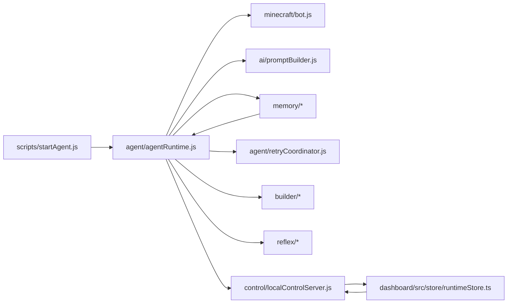

# Code Map

This repository is split between a Node.js agent runtime, a Mineflayer Minecraft edge, a SurrealDB persistence layer, and a Tauri dashboard. Start with the runtime bootstrap, then follow the orchestration path into the bot adapter, memory stores, and model clients. For a fast project orientation, see [README](../../README.md).

## Start Reading Here

1. `scripts/startAgent.js`
2. `agent/agentRuntime.js`
3. `minecraft/bot.js`
4. `memory/surrealClient.js`
5. `ai/promptBuilder.js`
6. `structures/retrySchemas.js`
7. `control/localControlServer.js`
8. `dashboard/src/store/runtimeStore.ts`

## Directory Map

| Path | Responsibility | Important files |
| --- | --- | --- |
| `scripts/` | Agent bootstrap and process shutdown | `startAgent.js` |
| `agent/` | Runtime orchestration, turn execution, retries, reconnects, and runtime state | `agentRuntime.js`, `actionExecutor.js`, `contextBuilder.js`, `retryCoordinator.js`, `retrySignatures.js`, `runtimeState.js`, `stateProjector.js`, `commandService.js`, `identityPresets.js` |
| `minecraft/` | Mineflayer bot adapter and world snapshotting | `bot.js`, `worldSnapshot.js` |
| `ai/` | Model-provider clients and prompt building | `minimaxClient.js`, `groqClient.js`, `ollamaClient.js`, `promptBuilder.js` |
| `memory/` | SurrealDB client and persistent stores | `surrealClient.js`, `messageStore.js`, `eventStore.js`, `worldStore.js`, `sessionStore.js`, `jobStore.js`, `learningStore.js`, `reflexStateStore.js`, `anchorStore.js`, `companionIdentityStore.js`, `profileStore.js` |
| `builder/` | Structure parsing, compilation, and build job execution | `requestParser.js`, `styleProfiles.js`, `structureCompiler.js`, `primitiveExecutor.js`, `buildWorker.js` |
| `reflex/` | Reflex classification and reflex job handling | `reflexClassifier.js`, `reflexWorker.js`, `reflexTemplates.js`, `worldIdentity.js` |
| `control/` | Local HTTP/WebSocket control plane for the dashboard | `localControlServer.js`, `runtimeEventBus.js` |
| `dashboard/` | Tauri + React operator console | `src/store/runtimeStore.ts`, `src/lib/runtimeClient.ts`, `src/lib/eventText.ts`, `src/components/KidMode.tsx`, `src/components/BuilderMode.tsx`, `src-tauri/src/main.rs` |
| `shared/contracts/` | Shared runtime, event, command, identity, anchor, and config contracts | `runtime.ts`, `events.ts`, `commands.ts`, `identity.ts`, `anchors.ts`, `config.ts`, `index.ts` |
| `structures/` | Structure templates and retry schema constants | `bridge.json`, `small_wood_house.json`, `index.js`, `retrySchemas.js` |
| `schemas/` | SurrealDB schema and event triggers | `surrealSchema.surql` |
| `tests/` | Unit checks for parsing, retries, storage, and adapters | `retryCoordinator.test.js`, `learningStore.test.js`, `retrySignatures.test.js`, `surrealClient.test.js`, `promptBuilder.test.js`, `minecraftBotAdapter.test.js` |

## Important Files And What They Do

### Bootstrap And Runtime

- `scripts/startAgent.js`: loads `.env`, validates config, constructs the Surreal client, stores, bot adapter, action executor, runtime, event bus, and control server, then starts the runtime.
- `agent/agentRuntime.js`: the main state machine. It binds Mineflayer events, serializes turns, handles retries and reconnects, starts background loops, and records lifecycle events.
- `agent/runtimeState.js`: defines the in-memory runtime state shape, revision counters, and task state helpers.
- `agent/stateProjector.js`: clones runtime state into a safe snapshot for the dashboard.

### Minecraft Edge

- `minecraft/bot.js`: wraps Mineflayer and exposes `say`, `followPlayer`, `moveTo`, `lookAt`, `digBlock`, `placeBlock`, `buildStructure`, `getSnapshot`, and `disconnect`.
- `minecraft/worldSnapshot.js`: captures the current world position, health, hunger, time of day, nearby entities, nearby blocks, and focused player state.

### Model And Prompting

- `ai/promptBuilder.js`: constructs the system prompt, turn prompt, and adventure-summary prompts from recent memory and world state.
- `ai/*Client.js`: provider-specific OpenAI-compatible wrappers. They normalize structured JSON replies, strip code fences/thinking tags, and expose `complete()` plus `summarizeAdventure()`.
- `agent/contextBuilder.js`: pulls recent messages, events, summaries, reflexes, and world snapshot data into a single prompt context.

### Persistence

- `memory/surrealClient.js`: connects to SurrealDB, bootstraps `schemas/surrealSchema.surql`, and sanitizes values before writes.
- `memory/messageStore.js`: persists chat messages and seeds the `characters` record used by the prompt.
- `memory/eventStore.js`: persists lifecycle events, adventure summaries, reflex events, retry events, and proximity hints.
- `memory/worldStore.js`: owns `worlds` records and deterministic world metadata.
- `memory/sessionStore.js`: owns per-connect session records.
- `memory/jobStore.js`: owns queued reflex and build jobs.
- `memory/learningStore.js`: stores retry learning events and graph edges, and synthesizes guidance summaries.
- `memory/reflexStateStore.js`: tracks cooldown state for reflex types.
- `memory/anchorStore.js`: stores durable anchor points, areas, faces, and paths.
- `memory/companionIdentityStore.js`: stores the active companion identity.
- `memory/profileStore.js`: stores saved identity/live-config profiles and seeds dashboard-friendly profiles for `applyConfigPatch()`.

### Build And Reflex Automation

- `builder/requestParser.js`: turns free-form build requests into a normalized `compose_structure` action.
- `builder/styleProfiles.js`: resolves style, size, palette, and feature defaults for builds.
- `builder/structureCompiler.js`: compiles a style plan into primitives and a bill of materials.
- `builder/primitiveExecutor.js`: expands primitives into block placements.
- `builder/buildWorker.js`: consumes build jobs, finds a build site, verifies materials, places blocks, and records `structure_build` events.
- `reflex/reflexClassifier.js`: scans the world for creepers, hostile mobs, dusk, villages, caves, idle time, rare biomes, terrain, low health, and memory proximity.
- `reflex/reflexWorker.js`: consumes reflex jobs, applies cooldowns, speaks the reflex line, and updates `reflex_state`.
- `reflex/reflexTemplates.js`: maps reflex types to short in-world messages.

### Control Plane And Dashboard

- `control/localControlServer.js`: serves `/health`, `/ready`, `/state`, `/config`, `/learning/what-worked`, `/command/*`, and the `/events` WebSocket stream.
- `control/runtimeEventBus.js`: emits ordered runtime events with a monotonic sequence number.
- `dashboard/src-tauri/src/main.rs`: launches the agent as a child process and passes the control-plane host, port, and token to it.
- `dashboard/src/store/runtimeStore.ts`: boots the runtime, subscribes to the WebSocket feed, patches config, and sends commands.

### Shared Contracts

- `shared/contracts/runtime.ts`: runtime state, retry state, reconnect state, and snapshot contracts.
- `shared/contracts/events.ts`: event envelopes for snapshots, state changes, retry events, task events, reconnect events, and graph queries.
- `shared/contracts/commands.ts`: dashboard command envelopes.
- `shared/contracts/config.ts`: live config, static config, and revision shapes.
- `shared/contracts/identity.ts`: companion identity and profile types.
- `shared/contracts/anchors.ts`: anchor types and payload shapes.

## Runtime Flow Between Modules

## Ownership Boundaries

| Layer | Owns | Does not own |
| --- | --- | --- |
| `agent/` | Turn policy, retries, reconnects, task queueing, background loops, runtime state | Direct Mineflayer protocol calls, raw persistence queries, provider HTTP plumbing |
| `memory/` | SurrealDB writes, reads, and schema alignment | Prompt policy, turn policy, pathfinding, chat parsing |
| `minecraft/` | Bot connection, movement, inventory, block placement, world snapshots | LLM policy, retry loop decisions, dashboard concerns |
| `ai/` | Provider normalization and prompt formatting | World scanning, persistence, reconnect policy |
| `retryCoordinator` + `retrySignatures` | Backoff, loop detection, and failure classification | Executing side effects or deciding Minecraft movement |
| `builder/` | Build request normalization and structure placement planning | Chat turn selection, reconnects, general memory retrieval |
| `reflex/` | Event detection and reflex job generation/execution | Direct user reasoning turns or model responses |
| `control/` + `dashboard/` | Human operator visibility and control | Core game logic |

## Start Reading Here

For a new contributor, the shortest path through the code is:

1. Read `scripts/startAgent.js` to see how the process is assembled.
2. Read `agent/agentRuntime.js` to understand the runtime state machine.
3. Read `minecraft/bot.js` to see what actions are actually possible.
4. Read `memory/surrealClient.js` and `schemas/surrealSchema.surql` to understand what is durable.
5. Read `ai/promptBuilder.js` and one provider client to see how responses are structured.
6. Read `builder/structureCompiler.js` and `builder/buildWorker.js` to understand build jobs.
7. Read `reflex/reflexClassifier.js` and `reflex/reflexWorker.js` to understand automatic responses.
8. Read `control/localControlServer.js` and `dashboard/src/store/runtimeStore.ts` if you need the operator surface.

## Known Risks / Gaps

- `shared/contracts/` and the runtime state shape are manually synchronized; keep them in lockstep when adding or renaming fields.
- `memory/eventStore.findNearbyMemoryHints()` looks for `named_location`, `discovery`, and `structure_build` events, but the current runtime only emits `structure_build` from the build worker. Memory proximity will stay sparse until more event producers exist.
- Retry classification depends on string matching in `agent/retrySignatures.js`; unfamiliar error messages can fall into the `unknown` bucket.
- The persistence tables are mostly schemaless, so payload drift can surface as runtime bugs rather than schema errors.
