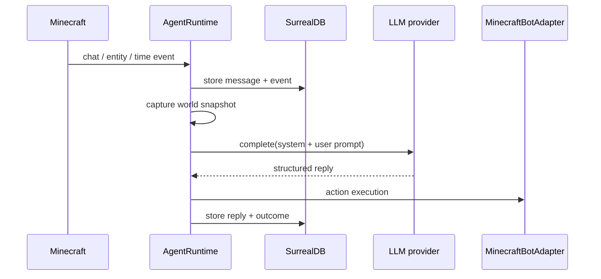

# Data Flow

This document traces the main data path from Minecraft input to runtime, model, action, and persistence.

## Primary Flow

## Synchronous Versus Async

### Synchronous Path

These steps run in the foreground of the turn:

- chat observation
- context assembly
- provider request
- action execution
- retry bookkeeping for the current attempt
- final storage of the reply and event outcome

### Async / Background Path

These run independently of the foreground turn:

- reflex scans on a timer
- reflex job processing
- build job processing
- adventure summary distillation
- reconnect backoff and recovery
- dashboard event streaming and reconnect

## Data Written At Each Stage

| Stage | Store | When it is written |
| --- | --- | --- |
| Incoming Minecraft chat | `messages` | Immediately on observation in `recordObservedChat()` |
| Incoming chat event | `events` | Immediately on observation in `recordObservedChat()` |
| World/session discovery | `worlds`, `sessions` | During `initializeWorldContext()` |
| Companion identity | `companion_identity` | On startup or when config patches change identity |
| Saved profiles | `saved_profiles` | When the operator saves or seeds profiles |
| Retry attempt/outcome | `learning_events`, `learning_edges` | On each retry attempt and outcome |
| Retry attempt/outcome events | `events` | On each retry attempt and outcome |
| Adventure summary | `events` | Periodically after enough chat has accumulated |
| Reflex detections | `events` | When `reflex/reflexClassifier.js` spots a new signal |
| Reflex jobs | `jobs` | Created by SurrealDB event triggers on `events` |
| Reflex cooldowns | `reflex_state` | When `reflex/reflexWorker.js` observes or triggers a reflex |
| Build jobs | `jobs` | When a build request is parsed into `compose_structure` |
| Build completion | `events`, `jobs` | When the build worker places the structure |
| Anchors | `anchors` | When the operator creates an anchor command |

## What Is Persisted

### Message Memory

`memory/messageStore.js` writes a recent conversation record with:

- `thread_id`
- `world_id`
- `session_id`
- `speaker`
- `content`
- `source`
- `timestamp`
- `metadata`

### Event Memory

`memory/eventStore.js` writes lifecycle and semantic events with:

- `type`
- `description`
- `location`
- `actor`
- `snapshot`
- `metadata`

These events are the main story trail for the runtime.

### Retry Learning

`memory/learningStore.js` writes:

- `learning_events` rows for attempt and outcome records
- `learning_edges` relation rows that connect attempt records to outcome records

`agent/agentRuntime.js` reads this history back to build retry guidance and the `what worked` summary.

## Working Theory: Memory Hint Coverage

`memory/eventStore.findNearbyMemoryHints()` searches for `named_location`, `discovery`, and `structure_build` events near the current position.

The current runtime definitely emits `structure_build` from `builder/buildWorker.js`. The other two event types are useful future hooks, but they are not widely produced by the current runtime path. That means memory proximity will stay sparse unless additional producers are added.

## Failure Modes From Data Flow

- If a store write fails, the runtime usually logs the error and keeps going, but the corresponding event can be missing.
- If a record shape drifts, the dashboard may still render raw JSON but the human-friendly fields can disappear.
- If SurrealDB is unavailable at startup, the runtime fails early instead of silently dropping persistence.
- If a model returns malformed JSON, provider parsing may fall back to freeform text or suppress the message.

## Known Risks / Gaps

- The system relies on schemaless tables plus convention, so changes to payload shape should be coordinated between runtime, dashboard, and schema.
- Some flows write both a durable store and an event record. If one succeeds and the other fails, the runtime can become partially observable.
- The data model is intentionally recent-window heavy. Long-term recall depends on summaries and learning guidance rather than a separate vector index.
