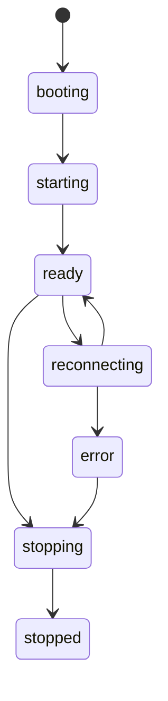
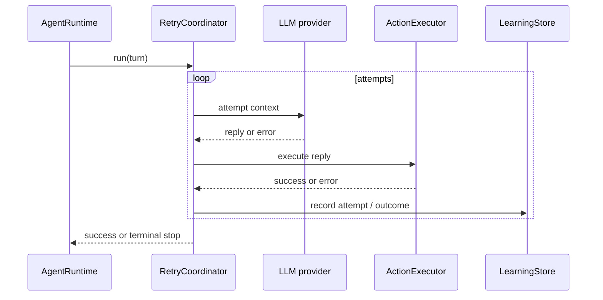

# Runtime Lifecycle

This file follows the process from startup to shutdown and shows where reconnects and retries hook in.

## Lifecycle State Machine

## Startup Sequence

1. `scripts/startAgent.js` loads environment variables with `dotenv`.
2. It constructs runtime config from `MC_*`, `AGENT_*`, `LLM_*`, `SURREAL_*`, and control-plane settings.
3. It validates the SurrealDB and provider configuration.
4. It creates the Surreal client and the stores in `memory/`.
5. It creates the Mineflayer adapter in `minecraft/bot.js`.
6. It creates `agent/actionExecutor.js` with the bot adapter and job store.
7. It constructs `agent/agentRuntime.js`.
8. It creates the `control/RuntimeEventBus` and `control/LocalControlServer`.
9. It starts the control server.
10. It starts the runtime.
11. It marks the control server ready.

## Connection Establishment

`agent/agentRuntime.js#start()` does the first real work after the process is up:

- sets lifecycle to `starting`
- binds Mineflayer event handlers
- connects the bot
- resolves world identity with `reflex/worldIdentity.js`
- upserts the `worlds` record
- pauses running build jobs for that world
- creates a new `sessions` record
- loads or seeds the active companion identity
- seeds default profiles if they do not exist
- counts historical messages and loads the latest adventure summary
- marks the runtime `ready`
- writes `session_start`, `world_entered`, and `spawn` events
- starts the reflex and build background loops
- runs an initial reflex scan

## Turn Execution Lifecycle

1. `minecraft/bot.js` emits a `chat` event.
2. `agent/agentRuntime.js#handleChat()` decides whether the message should be observed, answered, or interpreted as a direct command.
3. If it is a reasoning turn, the runtime creates a `turnId` and queues a task.
4. `processTurn()` waits for runtime availability and resolves an optional anchor target.
5. `RetryCoordinator.run()` owns the attempt loop.
6. Each attempt builds prompt context, calls the model, executes the action, and records retry events.
7. On success, the runtime stores the companion response and clears the active task.
8. On terminal failure, the runtime records `retry_stopped`, clears the task, and falls back to a short apology if possible.

### Backpressure

`agent/agentRuntime.js` keeps a `turnQueue` and a `pendingTurns` counter. If the queue gets too deep, the runtime records a backpressure event and answers with a short catch-up message instead of accepting unlimited parallel work.

## Retry Lifecycle

Retrying is scoped to one turn.

- `agent/retryCoordinator.js` performs exponential backoff with jitter.
- `agent/retrySignatures.js` normalizes errors into retry domains and signatures.
- `structures/retrySchemas.js` defines terminal outcomes and event envelopes.
- `memory/learningStore.js` records retry attempts and outcomes as `learning_events`.
- After `AGENT_RETRY_GRAPH_FROM_ATTEMPT` attempts, the runtime can inject guidance from recent outcome history.
- Loop detection stops retries when the same normalized failure repeats too many times.

## Reconnect Lifecycle

When Mineflayer emits an error or `end`, the runtime calls `handleConnectionLoss()`:

- it marks the runtime unavailable
- it interrupts the current turn task if one is active
- it creates a reconnect gate so new turns wait
- it emits `minecraft_reconnect_started`
- it starts a reconnect loop with backoff and jitter

On reconnect success:

- the bot reconnects
- world identity is re-initialized
- a new session is created
- lifecycle returns to `ready`
- `minecraft_reconnect_succeeded` is emitted

On reconnect failure:

- the runtime marks lifecycle `error`
- connection health becomes `disconnected`
- `minecraft_reconnect_failed` is emitted
- the reconnect gate is released so the runtime can fail cleanly

## Shutdown And Failure Behavior

`agent/agentRuntime.js#stop()` is the controlled shutdown path:

- stop background loops
- mark lifecycle `stopping`
- write a `session_end` event
- pause any running build jobs for the current world
- end the active session
- disconnect the Minecraft bot
- close SurrealDB
- mark lifecycle `stopped`

If a turn fails unexpectedly, `handleTurnError()` records a `turn_error` event and tries to send a short fallback chat message.

## Known Risks / Gaps

- Reconnect classification depends on string matching of Mineflayer and network errors.
- The reconnect loop creates a new session on each successful reconnect, which is correct for lifecycle tracking but can surprise operators if they expect one session per play day.
- A turn that is interrupted by a reconnect may still leave queued work in the dashboard until the runtime state catches up.
