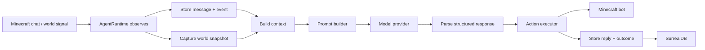

# System Overview

The Minecraft AI Companion is a local-first companion runtime. It observes Minecraft chat and nearby world state, builds a prompt from recent memory and live context, asks a model provider for a structured reply, executes the requested action, and stores the result in SurrealDB so future turns can learn from what happened. If you want the module-by-module map first, read [CODEMAP](../CODEMAP.md).

## Scope And Boundaries

| Node | Responsibility | Trust boundary |
| --- | --- | --- |
| Minecraft client/server | Game world, player movement, chat, blocks, and entities | Minecraft network and host availability |
| Agent runtime | Turn selection, retry policy, reconnect policy, background workers, and state projection | Process boundary |
| SurrealDB | Durable memory, jobs, identity, and retry learning | Persistence boundary |
| Model provider | Structured chat completion and adventure summaries | External API boundary |
| Dashboard | Human operator control and observability | Local control-plane boundary |

### Threat Model

**Working Theory:** the current design assumes honest-but-buggy local components. It is not hardened against malicious Minecraft peers, a compromised host, or prompt-level security claims. Identity and access boundaries are enforced in code and data flow, not by instructions to the model.

## Major Subsystems

- `scripts/startAgent.js` assembles the runtime graph.
- `agent/agentRuntime.js` is the orchestration layer.
- `minecraft/bot.js` is the protocol edge.
- `ai/promptBuilder.js` and `ai/*Client.js` are the model interface.
- `memory/*` stores durable state.
- `reflex/*` handles automatic reactions to world signals.
- `builder/*` turns build language into deterministic placement jobs.
- `control/*` and `dashboard/*` expose operator visibility and commands.

## Request / Response Lifecycle

1. A chat message arrives from Mineflayer.
2. `agent/agentRuntime.js` decides whether to observe it, respond to it, or treat it as a direct control command.
3. The runtime stores the incoming message and a matching event.
4. The runtime captures a fresh world snapshot.
5. `agent/contextBuilder.js` loads recent messages, recent events, recent adventure summaries, recent reflex events, and the latest retry guidance.
6. `ai/promptBuilder.js` builds the system and user prompts.
7. The selected provider client sends an OpenAI-compatible `chat/completions` request.
8. The provider response is parsed into a structured message plus action.
9. `agent/actionExecutor.js` runs the action through `minecraft/bot.js` or queues a build job.
10. The response, execution result, and event record are written back to SurrealDB.

## How Perception, Reasoning, And Action Fit Together

- **Perception** comes from `minecraft/worldSnapshot.js`, Mineflayer events, and reflex scans.
- **Reasoning** comes from the model provider plus the prompt assembled in `ai/promptBuilder.js`.
- **Action** comes from `agent/actionExecutor.js`, which translates the structured reply into Mineflayer calls or build jobs.

The runtime keeps those phases separate so the bot can reason about the world, but the actual effect on the world still happens through a narrow action layer.

## How Memory Influences Future Turns

The runtime does not train a model in place. Instead, it feeds prior context back into the next prompt:

- `memory/messageStore.js` contributes recent conversation.
- `memory/eventStore.js` contributes recent event history and adventure summaries.
- `memory/learningStore.js` contributes retry guidance and a `what worked` summary when the operator asks for it.
- `agent/agentRuntime.js` periodically writes `adventure_summary` events to compress older history into a smaller memory footprint.

**Working Theory:** this is best understood as retrieval and guidance, not model fine-tuning. The model gets a stronger prompt, but the weights do not change.

## Known Risks / Gaps

- Security is not prompt-only, but some behavior still depends on provider formatting and error classification heuristics.
- The runtime relies on recent-window memory rather than semantic search, which keeps it simple but can miss older context unless it has been summarized.
- Reflex memory hints currently depend on event types that are only partially populated by the runtime today.
